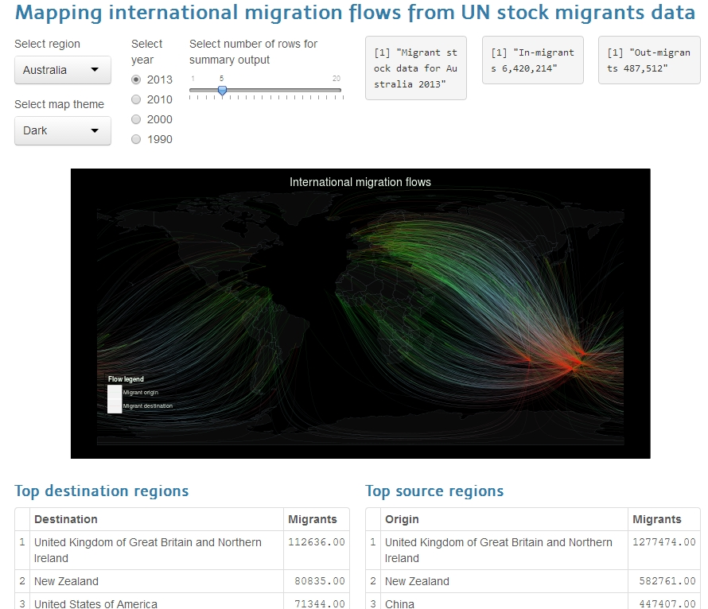
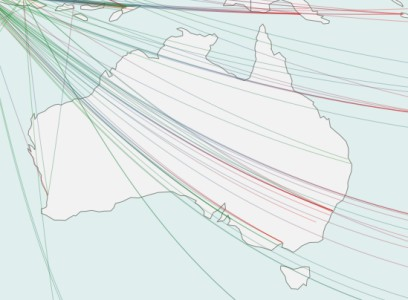
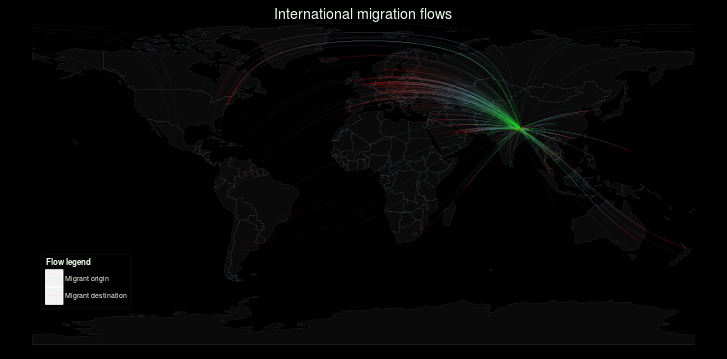

## Migrationviz readme

**Visualizing international migration flows using UN migrants stock data**

This app visualizes internal migration flows to and from regions using the **UN stock migrants data for 2013**, by connecting migrant's origin with destination with great circle lines. The origins and destinations of the arcs are coloured differently to visualize the direction of movement.

The number of arcs are based on the log of the migrant stock.

It's very easy to use, just select the region from the drop down box to update the map and data output. **That's it!**

A screenshot:



**Try it:** https://asheshwor.shinyapps.io/migrationviz/


## Source of data

Reading migration data from excel file:


```r
dataloc <- "data/UN_MigrantStockByOriginAndDestination_2013.xls"
readMigrationTable <- function() {
    data <- read.xlsx2(dataloc, sheetName = sheetName, startRow = 16,
                       colIndex = c(2, 4 , 10:241),
                       colClasses = c("character", rep("numeric", 232))) #read excel sheet selected columns and rows
    return(data)
  }
```

Reading world map shape file and cities database:


```r
  # read world shapefile downloaded from NaturalEarthData.com
  wmap <- readShapeSpatial("data/110m_cultural/ne_110m_admin_0_countries.shp")
  # read cities database downloaded from geonames.org
  places <- read.csv("data/cities1000.csv", header=FALSE, stringsAsFactors=FALSE)
```


## Getting data for the selected region in long format

With some processing and matching with proper names the data is like this with selected country as Malaysia:


```
##   source destination stock lat.d lon.d lat.s lon.s stocklog id
## 1     AF          MY   492   4.8   103    33    65        6  1
## 2     AF          MY   492   4.8   103    33    65        6  1
## 3     AF          MY   492   4.8   103    33    65        6  1
## 4     AF          MY   492   4.8   103    33    65        6  1
## 5     AF          MY   492   4.8   103    33    65        6  1
```

```
##     source destination stock lat.d lon.d lat.s lon.s stocklog  id
## 626     VN          MY 85709   4.8   103    16   106       11 100
## 627     VN          MY 85709   4.8   103    16   106       11 100
## 628     VN          MY 85709   4.8   103    16   106       11 100
## 629     VN          MY 85709   4.8   103    16   106       11 100
## 630     VN          MY 85709   4.8   103    16   106       11 100
```

The coordinates for the migrants' origin and destination are same for each location. In next step, the coordinates will be replaced with locations of cities in the region rather than one fixed coordination for the entire region.


## Selecting origin and destination points
To select the location, the data is sorted by location and the ```getRandomCity``` function retrives a dataframe with the specified number of cities in the selected region with probability of selection based on the city population.


```r
sample(c(1:nrow(allCities)), num, replace=TRUE, prob=allCities$pop)
```



Cities with higher population are more likely to get selected.


## Generating the final map
using ```gcIntermediate``` function, the coordinates of the lines forming the great circles are generated which is plotted using ```ggplot2```. Below is an example plot for Nepal with 'dark' map theme.



Try it yourself at https://asheshwor.shinyapps.io/migrationviz/

**Thank you!**

